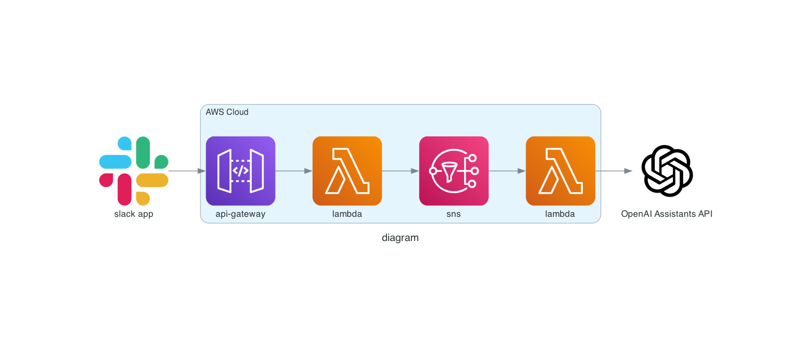
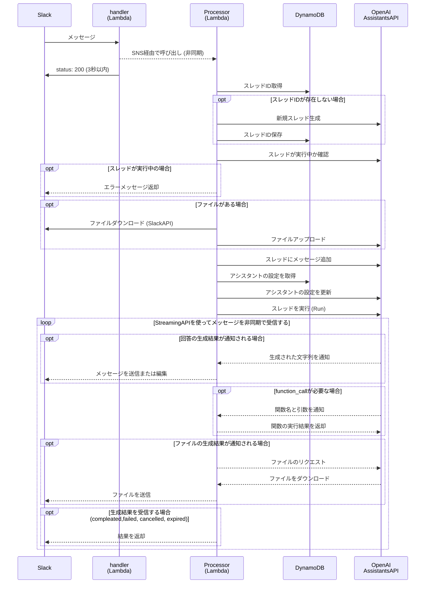
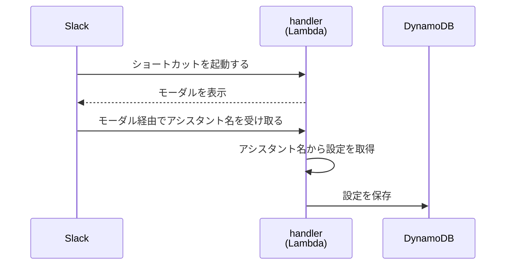
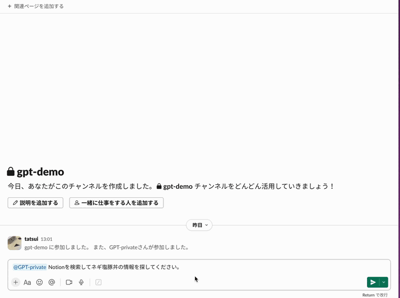
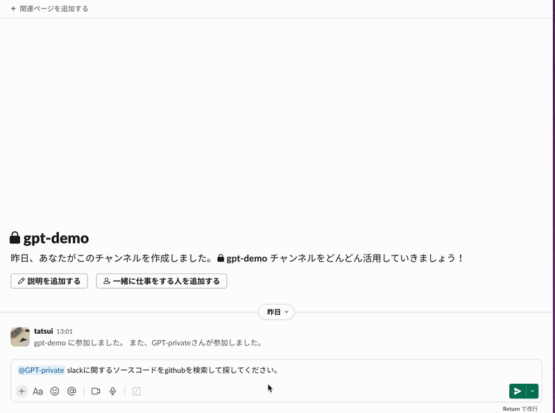
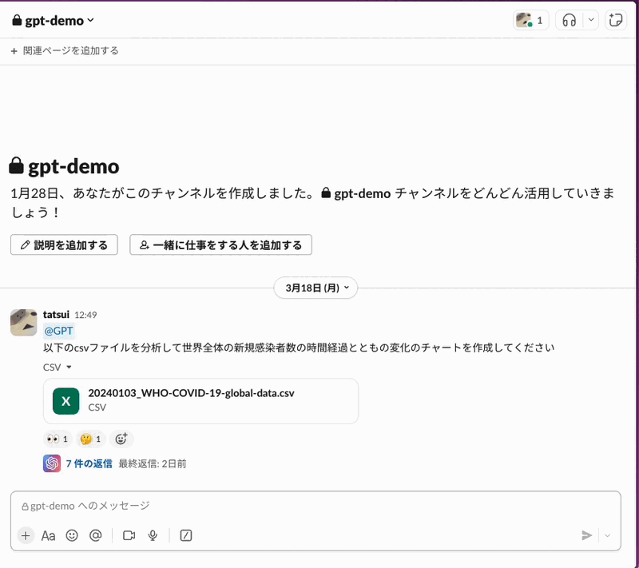
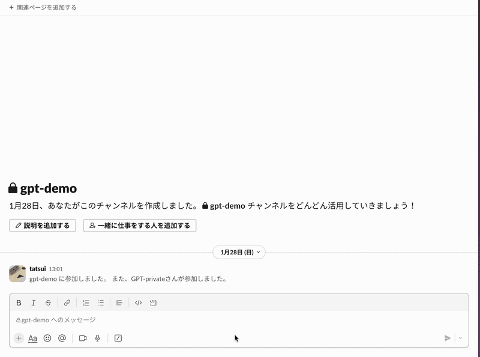

# 概要
ナレッジ管理に特化したSlackで動作するChatGPTです。  

[Assistants API streaming でSlack Copilotを作った](https://zenn.dev/tatsui/articles/slack-copilot)

## Features

- [x] Assistant APIを利用したslack専用チャットbot
- [x] スレッドやcanvas、アップロードしたファイルを文脈として自動入力
- [x] notion github google driveなどナレッジの検索が可能
- [x] APIクレジットを無駄遣いしないように練習モードを搭載
- [ ] ユーザの発言を学習することで、より自然な発言を行うことが可能

## アーキテクチャ


## 動作フロー
Events API


ショートカットコマンド


## Demo
### 1. CSVファイルの分析

### 2. Notion検索

### 3. Github検索

### 4. アシスタントの変更

### 5. インシデント対応

### 6. Unfurl


## セットアップ
```bash
cp env.sample .envrc
direnv allow
npm install -g serverless
serverless plugin install -n serverless-api-gateway-throttling
serverless plugin install -n serverless-prune-plugin
aws ecr-public get-login-password --region us-east-1 | docker login --username AWS --password-stdin public.ecr.aws
sls deploy
```

## APIs
* [OpenAI API](https://platform.openai.com/api-keys)
* [Google AI Studio](https://makersuite.google.com/app/apikey?hl=ja)
* [Fact Check API](https://console.cloud.google.com/marketplace/product/google/factchecktools.googleapis.com?q=search&referrer=search)
* [Google Drive API](https://console.cloud.google.com/marketplace/product/google/drive.googleapis.com?q=search&referrer=search)
* [Notion API](https://developers.notion.com/)
* [Intelligence X API](https://intelx.io/account?tab=developer)
* [Github アクセストークン](https://docs.github.com/ja/authentication/keeping-your-account-and-data-secure/managing-your-personal-access-tokens)

## 関連
* [Slack Botの種類と大まかな作り方](https://qiita.com/namutaka/items/233a83100c94af033575)
* [OpenAI Assistants API で Slack チャットボットを構築する](https://zenn.dev/taroshun32/articles/slack-chatbot-with-openai-asistant)
